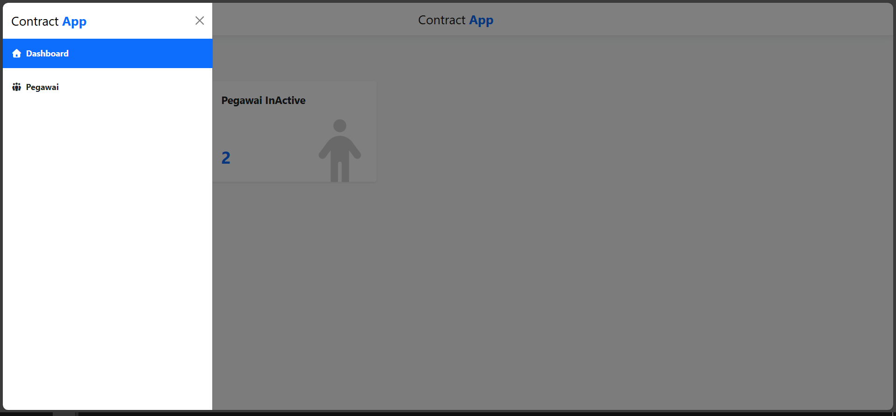

# Contract APP

Contract App is a web-based application built with Razor Pages for the Front End and ASP.NET Core for the Back End. The application is designed to monitor employees whose contract periods are about to expire.


## Tech Stack

**Client:** Razor Pages, ASP.NET Core, Javascript, Bootstrap

**Server:** ASP.NET Core API, SQL Server


## Features Client

- Dashboard Page
- Employee Page
- Upload Excel File
- Filter By Start and End Date Contract

## Features Server
- Endpoint Get All Employee with Stored Procedure SQL Server
- Endpoint Get All Count Active and InActive Employee
- Endpoint Post create/update from Excel File
## Installation

Clone Project Repository

```bash
  git clone https://github.com/Myudhaap/ASPNET-contract-app.git
```

Restore NuGet
```bash
dotnet restore
```    

Restore Libman
```bash
libman restore
```

Run each project using this keyword or Running in Visual Studio
```bash
dotner run
```

Dont forget to change config of project with your environment
## Demo

Dashoard


Sidebar


Employee


Employee Upload


## License

[Github: @Myudhaap](https://github.com/Myudhaap)

